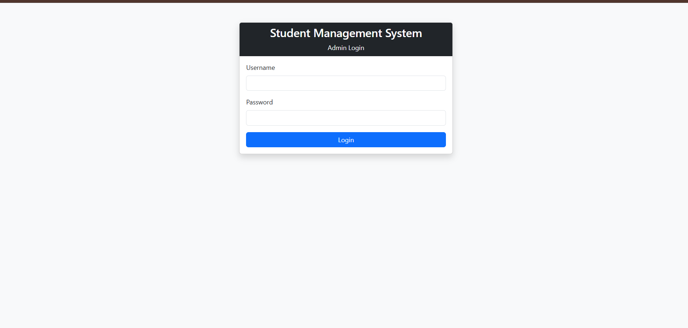
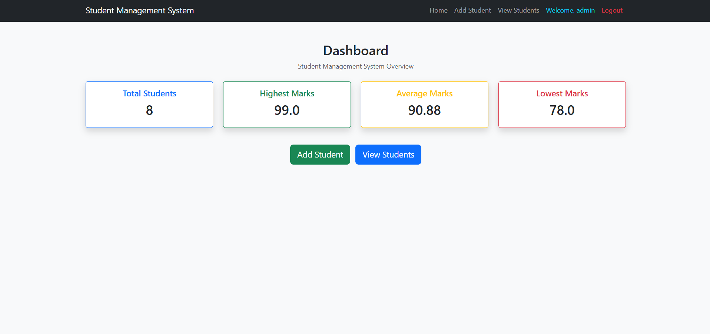
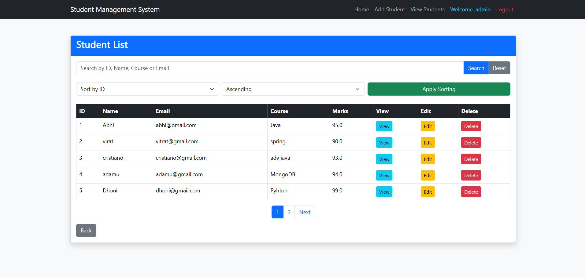
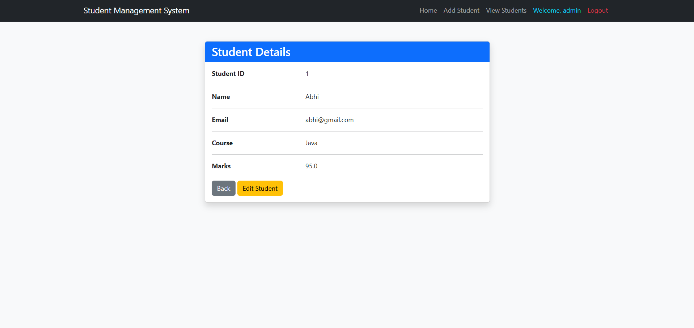

# Student Management System

A web-based Student Management System developed using Java Servlets, JSP, JDBC, Oracle Database, Maven, and Bootstrap.

The application allows an administrator to manage student records through a web interface with authentication, CRUD operations, search, sorting, pagination, validation, and student details.

## Features

* Admin Login and Logout
* Session-based Authentication
* Login Filter for Protected Pages
* Dashboard with Student Statistics
* Add Student
* View Students
* View Student Details
* Edit Student
* Delete Student
* Search Students
* Sort Students
* Pagination
* Form Validation
* Delete Confirmation
* Success and Error Messages
* Oracle Database Integration
* DAO-based Database Architecture
* Database SQL Scripts
* DAO Test Classes

## Technologies Used

* Java
* Jakarta Servlets
* JSP (JavaServer Pages)
* JDBC
* Oracle Database
* Maven
* Bootstrap 5
* Apache Tomcat
* IntelliJ IDEA
* Git and GitHub

## Screenshots

### Login



### Dashboard



### Student List



### Student Details



## Architecture

The project follows a Servlet/JSP architecture with the DAO pattern.

```text
                    Browser
                       |
                       v
                  JSP / HTML
                       |
                       v
                    Servlet
                       |
                       v
                     DAO
                       |
                       v
                    JDBC
                       |
                       v
                Oracle Database
```

### Responsibilities

**JSP**

Handles the presentation layer and displays information to the user.

**Servlet**

Receives HTTP requests, processes the request, communicates with the DAO layer, and forwards or redirects the user.

**DAO**

Provides an abstraction for database operations.

**DAO Implementation**

Contains the actual JDBC and SQL implementation.

**Model**

Represents application data such as Student and Admin.

**JDBC**

Provides communication between the Java application and Oracle Database.

**Oracle Database**

Stores student and administrator information.

## Project Structure

```text
StudentManagementSystem
│
├── database
│   ├── admin.sql
│   └── schema.sql
│
├── screenshots
│   ├── login.png
│   ├── dashboard.png
│   ├── student-list.png
│   └── student-details.png
│
├── src
│   ├── main
│   │   ├── java
│   │   │   └── com.abhilash.studentms
│   │   │       │
│   │   │       ├── controller
│   │   │       │   ├── AddStudentServlet.java
│   │   │       │   ├── DashboardServlet.java
│   │   │       │   ├── DeleteStudentServlet.java
│   │   │       │   ├── EditStudentServlet.java
│   │   │       │   ├── LoginServlet.java
│   │   │       │   ├── LogoutServlet.java
│   │   │       │   ├── SearchStudentServlet.java
│   │   │       │   ├── StudentDetailsServlet.java
│   │   │       │   ├── UpdateStudentServlet.java
│   │   │       │   └── ViewStudentsServlet.java
│   │   │       │
│   │   │       ├── dao
│   │   │       │   ├── AdminDAO.java
│   │   │       │   ├── AdminDAOImpl.java
│   │   │       │   ├── StudentDAO.java
│   │   │       │   └── StudentDAOImpl.java
│   │   │       │
│   │   │       ├── filter
│   │   │       │   └── LoginFilter.java
│   │   │       │
│   │   │       ├── model
│   │   │       │   ├── Admin.java
│   │   │       │   └── Student.java
│   │   │       │
│   │   │       └── util
│   │   │           └── DBConnection.java
│   │   │
│   │   ├── resources
│   │   │
│   │   └── webapp
│   │       ├── includes
│   │       │   └── navbar.jsp
│   │       │
│   │       ├── WEB-INF
│   │       │   └── web.xml
│   │       │
│   │       ├── add-student.jsp
│   │       ├── edit-student.jsp
│   │       ├── index.jsp
│   │       ├── login.jsp
│   │       ├── student-details.jsp
│   │       └── view-students.jsp
│   │
│   └── test
│       ├── TestAdminDAO.java
│       ├── TestConnection.java
│       ├── TestDeleteStudent.java
│       ├── TestGetAllStudents.java
│       ├── TestGetStudentById.java
│       ├── TestStudentDAO.java
│       └── TestUpdateStudent.java
│
├── pom.xml
├── .gitignore
└── README.md
```

## Authentication

The application provides an administrator login system.

The login flow is:

```text
Login Page
    |
    v
LoginServlet
    |
    v
AdminDAO
    |
    v
Oracle Database
    |
    v
Create Session
    |
    v
Dashboard
```

A session is used to maintain the logged-in administrator.

The `LoginFilter` protects application pages from unauthorized access.

The user can logout through the Logout option, which terminates the session.

## Dashboard

The dashboard provides an overview of the student data.

It displays:

* Total Students
* Highest Marks
* Average Marks
* Lowest Marks

## Student Management

The system provides complete CRUD functionality.

### Add Student

An administrator can add a new student by providing:

* Student ID
* Name
* Email
* Course
* Marks

### View Students

The application displays student records in a table.

The table provides:

* Student ID
* Name
* Email
* Course
* Marks
* View
* Edit
* Delete

### View Student Details

The View option displays the complete information of an individual student.

### Edit Student

An administrator can update existing student information.

### Delete Student

An administrator can delete a student after confirming the deletion.

## Search

Students can be searched using information such as:

* ID
* Name
* Email
* Course

The search functionality allows administrators to quickly find specific student records.

## Sorting

The student list supports sorting using different fields.

Available sorting fields include:

* ID
* Name
* Email
* Course
* Marks

Both ascending and descending sorting are supported.

## Pagination

Student records are displayed using pagination instead of loading all records on a single page.

The application displays a fixed number of students per page and provides navigation between pages.

Search and sorting parameters are preserved while navigating through pages.

## Form Validation

The Add Student and Edit Student forms include validation for common input errors.

Examples include:

* Required fields
* Valid numeric Student ID
* Valid email format
* Name length
* Course length
* Marks between 0 and 100

## Database

The application uses Oracle Database for persistent storage.

Database scripts are provided in:

```text
database/
├── admin.sql
└── schema.sql
```

`schema.sql` contains the database schema required for the application.

`admin.sql` contains the administrator-related database setup.

## DAO Pattern

The project uses the DAO (Data Access Object) pattern to separate database logic from the rest of the application.

For students:

```text
StudentDAO
     |
     v
StudentDAOImpl
     |
     v
JDBC
     |
     v
Oracle Database
```

For administrators:

```text
AdminDAO
     |
     v
AdminDAOImpl
     |
     v
JDBC
     |
     v
Oracle Database
```

This separation makes the application easier to maintain and organize.

## Testing

The project includes test classes for database connectivity and DAO operations, including:

* `TestConnection`
* `TestAdminDAO`
* `TestStudentDAO`
* `TestGetAllStudents`
* `TestGetStudentById`
* `TestUpdateStudent`
* `TestDeleteStudent`

These tests are used to verify database connectivity and important student and administrator database operations.

## How to Run

### Prerequisites

Install and configure:

1. Java JDK
2. Oracle Database
3. Apache Tomcat
4. Maven
5. IntelliJ IDEA

### Database Setup

1. Start Oracle Database.
2. Create or configure the required database user.
3. Execute the SQL scripts from the `database` directory.
4. Configure the Oracle database URL, username, and password in the application's database connection configuration.

> Do not commit database passwords or other sensitive credentials to GitHub.

### Run the Project

1. Clone or download the project.
2. Open the project in IntelliJ IDEA.
3. Allow Maven to download the required dependencies.
4. Configure Apache Tomcat.
5. Build the project.
6. Deploy the application to Tomcat.
7. Start Tomcat.
8. Open the application in a browser.

The application will be available using the configured Tomcat port and application context.

## Maven

Maven is used for project configuration and dependency management.

The project configuration is available in:

```text
pom.xml
```

The project can be built using:

```bash
mvn clean package
```

## Git and GitHub

Git is used for version control.

The project was developed using separate commits for different features and changes.

The final project is maintained in a GitHub repository.

## Author

**Abhilash**

## Project Status

**Version 1.0 — Complete**
